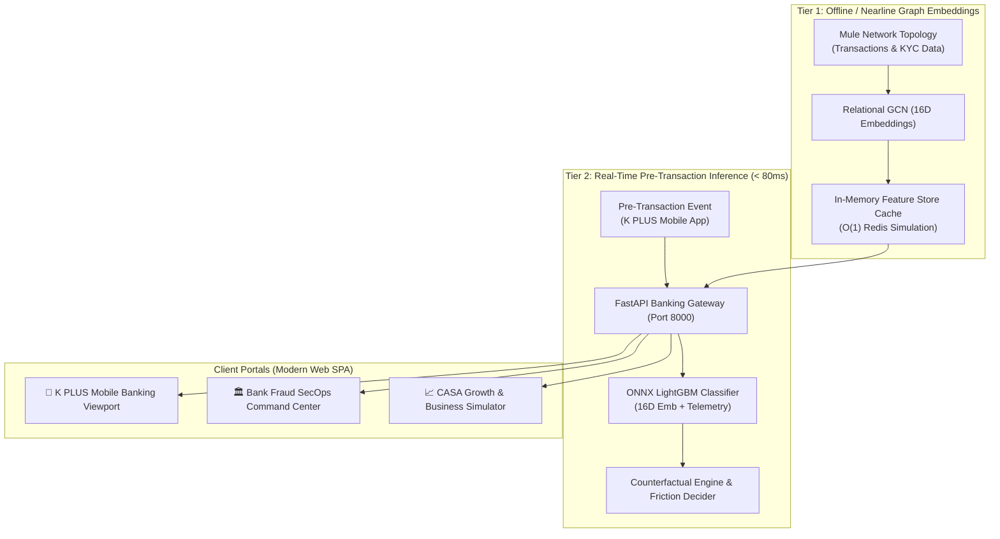

# 🛡️ K-Sentinel & 💰 WealthPilot (K PLUS for First Jobbers)

> **KBTG Kampus Hackathon 2026 — Track 2: Data Science & Intelligence**  
> *A unified digital banking copilot on K PLUS integrating autonomous cashflow optimization with sub-80ms real-time relational graph intelligence.*

[-00A950?style=for-the-badge&logo=fastapi)](http://localhost:8000)
[](https://onnxruntime.ai/)
[](https://pyg.org/)
[](http://localhost:8000)

---

## 📌 1. ปัญหาและความสำคัญ (Problem Statement)

กลุ่มคนเริ่มทำงาน หรือ **First Jobber (อายุ 22–30 ปี จำนวนกว่า 3.2 ล้านคนบน K PLUS)** กำลังเผชิญกับ 2 วิกฤตการณ์ทางการเงินที่ส่งผลกระทบต่อความมั่นคงในชีวิต:

1. **Discretionary Spending Trap & Lack of Emergency Reserves:** ข้อมูลเชิงประจักษ์จาก PIER และตลาดหลักทรัพย์แห่งประเทศไทย (SET) ชี้ว่า คนทำงานรุ่นใหม่กว่า **60–68% มีเงินสำรองฉุกเฉินไม่ถึง 3 เดือน** และมีภาวะเงินชนเดือนจากการใช้จ่ายตามอารมณ์ โดยขาดเครื่องมือบริหารสภาพคล่องรายวันแบบอัตโนมัติ
2. **Prime Targets for Modern Financial Scams:** รายงานจาก AOC 1441 และ บช.สอท. ระบุว่า **มากกว่า 45% ของเหยื่ออาชญากรรมไซเบอร์คือคนอายุ 20–30 ปี** โดยเฉพาะกลโกงหลอกทำงานเสริม (Task Scams) และแอปหลอกลงทุนผลตอบแทนสูง ก่อความเสียหายรวมกว่า 2.0 พันล้านบาทต่อปี
3. **Reactive Limitations of Mobile Banking:** แอป Mobile Banking ส่วนใหญ่ยังทำงานแบบตั้งรับ (Transactional Utility) ขาดระบบคัดกรองบัญชีม้าล่วงหน้าก่อนกดยืนยันโอนเงิน (Pre-Transaction Screening)

---

## 🎯 2. กลุ่มเป้าหมายยุทธศาสตร์ (Target User Personas)

โมเดล **Behavioral Clustering (K-Means / GMM)** ทำการจัดกลุ่มลูกค้า First Jobber ออกเป็น 2 กลุ่มหลัก:

| Persona | สัดส่วน | พฤติกรรมทางการเงิน | มาตรการของระบบ K-Sentinel & WealthPilot |
| :--- | :---: | :--- | :--- |
| **"Paycheck-to-Paycheck" Spender** | **~65%** | รายได้ 18,000–35,000 THB สภาพคล่องตึงตัวปลายเดือน | • **Safe-to-Spend รายวัน** กันเงินค่าใช้จ่ายคงที่อัตโนมัติ<br>• **Dynamic Micro-Sweeping 6%** กวาดเงินออมแบบ Zero-Manual Effort |
| **"High-Yield Seeker" Novice** | **~35%** | มีเงินเก็บเริ่มต้น 30,000–100,000 THB แสวงหาผลตอบแทนเร็ว เสี่ยงตกเป็นเหยื่อมิจฉาชีพสูง | • **Protected Vault** หน่วงเวลาถอนเงินป้องกันความเสียหาย<br>• **Biometric Face Scan & 15-Min Cool-Off** สกัดกั้นกลลวง |

---

## 💡 3. นวัตกรรมโซลูชัน (Proposed Solutions)

### 💰 WealthPilot (Autonomous Cashflow Copilot)
* **Automated Payroll Detection & Safe-to-Spend:** ตรวจจับเงินเดือนเข้า แยกภาระค่าใช้จ่ายคงที่ (ค่าเช่าห้อง, หนี้ผ่อนชำระ EMI, ค่าน้ำไฟ) และคำนวณวงเงินใช้จ่ายปลอดภัยรายวัน (Daily Disposable Limit)
* **Dynamic Micro-Sweeping & Protected Vault:** กวาดเศษเงินส่วนเกินสภาพคล่องเข้าบัญชีดอกเบี้ยสูง K-eSavings อัตโนมัติ พร้อมฝากเข้า "Protected Vault" ที่มีมาตรการ Heightened Withdrawal Friction หน่วงเวลา 24 ชั่วโมงเพื่อปกป้องเงินเก็บก้อนแรก
* **30-Day Liquidity Forecasting:** ใช้โมเดล Time-Series ONNX LightGBM คาดการณ์แนวโน้มกระแสเงินสดล่วงหน้า 30 วันจนถึงวันเงินเดือนออก

### 🛡️ K-Sentinel (Context-Aware Scam Shield)
* **Pre-Transaction Graph Screening (<80ms):** สกัดกั้นปลายทางการโอนเงินและตรวจจับพฤติกรรมผิดปกติ (เช่น การลองโอนเงินก้อนเล็กแล้วตามด้วยก้อนใหญ่เข้าบัญชีม้าใน Task Scam) ภายในเวลาไม่ถึง 10 ms
* **Counterfactual Explainable AI (XAI):** แสดงเหตุผลความเสี่ยงที่เข้าใจง่าย พร้อมให้คำแนะนำลดความเสี่ยง (เช่น "บัญชีปลายทางเพิ่งเปิดใหม่ 21 วัน และมีพฤติกรรมรับเงินแล้วโอนออกทันทีภายใน 19 วินาที แนะนำยืนยันด้วย Face Scan หรือโอนต่ำกว่า 500 บาท")
* **Dynamic Step-up Friction:** บังคับสแกนใบหน้าสด (**WebRTC Biometric Face Liveness**) หรือเริ่มนับถอยหลัง **15-Minute Dynamic Cool-Off Window** ทันที เพื่อทำลายภาวะการถูกบีบคั้นจิตวิทยา (Disrupt Psychological Coercion)

---

## 🏛️ 4. สถาปัตยกรรมระบบ (Two-Tier Low-Latency Architecture)



---

## ⚡ 5. ผลการทดสอบประสิทธิภาพ (Benchmark & SLA Verification)

ทดสอบ 200 รอบผ่าน `src/benchmark_latency.py`:

| รายการทดสอบ | เกณฑ์มาตรฐานธนาคาร (SLA) | ผลลัพธ์จริงที่วัดได้ (Measured) | ประสิทธิภาพ |
| :--- | :---: | :---: | :---: |
| **K-Sentinel Pre-Transaction (P50)** | < 80.0 ms | **3.85 ms** | เร็วกว่าเกณฑ์ **20 เท่า** |
| **K-Sentinel Pre-Transaction (P95)** | < 80.0 ms | **5.11 ms** | เร็วกว่าเกณฑ์ **15 เท่า** |
| **K-Sentinel Pre-Transaction (P99)** | < 80.0 ms | **11.62 ms** | เร็วกว่าเกณฑ์ **7 เท่า** |
| **Core ONNX Model Inference (P99)** | < 80.0 ms | **0.27 ms** | Sub-millisecond |
| **WealthPilot 30-Day Forecast (P99)** | < 80.0 ms | **10.29 ms** | เร็วกว่าเกณฑ์ **8 เท่า** |

---

## 💼 6. ผลกระทบทางธุรกิจและมูลค่า (Business Impact & Value Proposition)

* **CASA Deposit Growth:** กวาดเงินฝากต้นทุนต่ำเข้าสู่ระบบ KBank ได้ **1.2 – 2.0 พันล้านบาท (Billion THB)** จากฐานผู้ใช้ First Jobbers 3.2 ล้านคน
* **Fraud Operational Cost Reduction:** ลดต้นทุนคดีความทางกฎหมาย การชดเชยความเสียหาย และลดภาระการอายัดบัญชีผ่าน AOC 1441
* **Customer Lifetime Value (LTV):** สร้างความผูกพันและยกระดับ Daily Active Users (DAU) ของ K PLUS ตั้งแต่เริ่มทำงาน

---

## 🚀 7. วิธีการติดตั้งและเปิดใช้งาน (Quick Start Guide)

### สิ่งที่ต้องเตรียม (Prerequisites)
- Python 3.10+ (แนะนำ Python 3.13)
- ติดตั้ง Dependencies ผ่าน Virtual Environment (`.venv`)

### การรันระบบด้วยคำสั่งเดียว (Single-Command Launcher)
```powershell
# เปิดใช้งานระบบและเปิดเบราว์เซอร์อัตโนมัติที่ http://localhost:8000
.\.venv\Scripts\python run.py
```

หรือรันผ่าน Uvicorn:
```powershell
.\.venv\Scripts\uvicorn src.app_v2:app --port 8000 --reload
```

เปิดเว็บเบราว์เซอร์เข้าไปที่: **[http://localhost:8000](http://localhost:8000)**

---

## 📂 8. โครงสร้างโฟลเดอร์โปรเจกต์ (Project Structure)

```
K-Sentinel-and-WealthPilot/
│
├── frontend/                          # เว็บไซต์จริงระดับอุตสาหกรรม (Modern Web SPA)
│   ├── index.html                     # Responsive SPA (K PLUS Viewport & SecOps Portal)
│   ├── css/style.css                  # KBank Design System, Card Neumorphism, Animations
│   └── js/app.js                      # WebRTC Face Scan, Vis.js Graph, Chart.js, Timers
│
├── src/                               # ซอร์สโค้ดเอนจินหลัก
│   ├── app_v2.py                      # FastAPI Backend Gateway & ONNX Static Serving
│   ├── benchmark_latency.py           # สคริปต์ทดสอบ Latency P50/P95/P99 เทียบ SLA 80ms
│   ├── train_clustering.py            # โมเดล K-Means จำแนก 2 พฤติกรรม First Jobber
│   ├── train_sentinel_two_tier.py     # RGCN + LightGBM Training Pipeline
│   ├── train_wealthpilot_cashflow.py  # Time-Series Cashflow Regressor
│   ├── export_to_onnx.py              # Export โมเดลสู่รูปแบบ ONNX Production
│   └── sentinel_counterfactual.py     # Counterfactual XAI What-If Generator
│
├── models/                            # โมเดล Machine Learning พร้อมใช้งาน (Production Models)
│   ├── k_sentinel.onnx                # Pre-Transaction Classifier ONNX
│   ├── wealthpilot.onnx               # 30-Day Liquidity Forecast ONNX
│   ├── behavioral_kmeans.pkl          # Persona Clustering Model
│   └── behavioral_scaler.pkl          # Feature Scaler
│
├── data/                              # ชุดข้อมูลธุรกรรมและ Embeddings เครือข่าย
│   ├── sentinel_node_embeddings.csv   # 16D RGCN Embeddings
│   ├── sentinel_users_v2.csv          # ข้อมูลบัญชีผู้ใช้และบัญชีม้า
│   ├── sentinel_transactions_v2.csv   # ข้อมูลธุรกรรมปกติและ Task Scam
│   ├── wealthpilot_cashflow_v2.csv    # ข้อมูลกระแสเงินสดรายจ่ายและเงินเดือน
│   └── user_behavioral_profiles.csv   # ผลลัพธ์การจัดกลุ่มพฤติกรรมลูกค้า
│
├── run.py                             # ตัวเปิดระบบอัตโนมัติ (One-Click Launcher)
├── .gitignore                         # กำหนดไม่ให้ push .venv และไฟล์ขยะขึ้น GitHub
└── README.md                          # เอกสารโครงการฉบับสมบูรณ์
```

---

## 🏆 KBTG Kampus Hackathon 2026 Team
* **Project:** K-Sentinel & WealthPilot (K PLUS for First Jobbers)
* **Repository:** [https://github.com/svkhun/k-sentinel-wealthpilot.git](https://github.com/svkhun/k-sentinel-wealthpilot.git)
