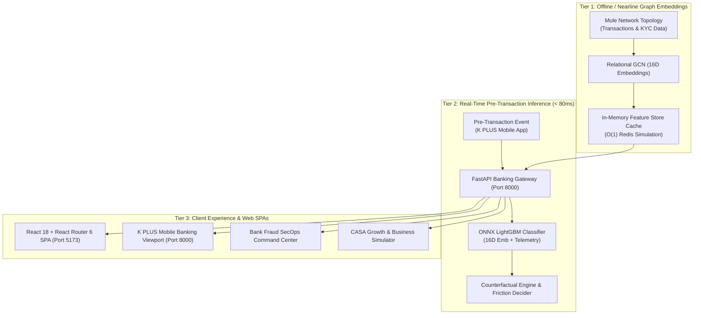

#  K-Sentinel &  WealthPilot (K PLUS for First Jobbers)

> **KBTG Kampus Hackathon 2026 — Track 2: Data Science & Intelligence**  
> *A unified digital banking copilot on K PLUS integrating autonomous cashflow optimization with sub-80ms real-time relational graph intelligence.*

[](https://k-sentinel-wealthpilot.onrender.com/)
[-00A950?style=for-the-badge&logo=fastapi)](https://k-sentinel-wealthpilot.onrender.com/)
[](https://onnxruntime.ai/)
[](https://pyg.org/)
[](http://localhost:5173)
[](https://tailwindcss.com)

---

##  1. ปัญหาและความสำคัญ (Problem Statement)

กลุ่มคนเริ่มทำงาน หรือ **First Jobber (อายุ 22–30 ปี จำนวนกว่า 3.2 ล้านคนบน K PLUS)** กำลังเผชิญกับ 2 วิกฤตการณ์ทางการเงินที่ส่งผลกระทบต่อความมั่นคงในชีวิต:

1. **Discretionary Spending Trap & Lack of Emergency Reserves:** ข้อมูลเชิงประจักษ์จาก PIER และตลาดหลักทรัพย์แห่งประเทศไทย (SET) ชี้ว่า คนทำงานรุ่นใหม่กว่า **60–68% มีเงินสำรองฉุกเฉินไม่ถึง 3 เดือน** และมีภาวะเงินชนเดือนจากการใช้จ่ายตามอารมณ์ โดยขาดเครื่องมือบริหารสภาพคล่องรายวันแบบอัตโนมัติ
2. **Prime Targets for Modern Financial Scams:** รายงานจาก AOC 1441 และ บช.สอท. ระบุว่า **มากกว่า 45% ของเหยื่ออาชญากรรมไซเบอร์คือคนอายุ 20–30 ปี** โดยเฉพาะกลโกงหลอกทำงานเสริม (Task Scams) และแอปหลอกลงทุนผลตอบแทนสูง ก่อความเสียหายรวมกว่า 2.0 พันล้านบาทต่อปี
3. **Reactive Limitations of Mobile Banking:** แอป Mobile Banking ส่วนใหญ่ยังทำงานแบบตั้งรับ (Transactional Utility) ขาดระบบคัดกรองบัญชีม้าล่วงหน้าก่อนกดยืนยันโอนเงิน (Pre-Transaction Screening)

---

##  2. กลุ่มเป้าหมายยุทธศาสตร์ (Target User Personas)

โมเดล **Behavioral Clustering (K-Means / GMM)** ทำการจัดกลุ่มลูกค้า First Jobber ออกเป็น 2 กลุ่มหลัก:

| Persona | สัดส่วน | พฤติกรรมทางการเงิน | มาตรการของระบบ K-Sentinel & WealthPilot |
| :--- | :---: | :--- | :--- |
| **"Paycheck-to-Paycheck" Spender** | **~65%** | รายได้ 18,000–35,000 THB สภาพคล่องตึงตัวปลายเดือน | • **Safe-to-Spend รายวัน** กันเงินค่าใช้จ่ายคงที่อัตโนมัติ<br>• **Dynamic Micro-Sweeping 6%** กวาดเงินออมแบบ Zero-Manual Effort |
| **"High-Yield Seeker" Novice** | **~35%** | มีเงินเก็บเริ่มต้น 30,000–100,000 THB แสวงหาผลตอบแทนเร็ว เสี่ยงตกเป็นเหยื่อมิจฉาชีพสูง | • **Protected Vault** หน่วงเวลาถอนเงินป้องกันความเสียหาย<br>• **Biometric Face Scan & 15-Min Cool-Off** สกัดกั้นกลลวง |

---

##  3. นวัตกรรมโซลูชัน (Proposed Solutions)

###  WealthPilot (Autonomous Cashflow Copilot)
* **Automated Payroll Detection & Safe-to-Spend:** ตรวจจับเงินเดือนเข้า แยกภาระค่าใช้จ่ายคงที่ (ค่าเช่าห้อง, หนี้ผ่อนชำระ EMI, ค่าน้ำไฟ) และคำนวณวงเงินใช้จ่ายปลอดภัยรายวัน (Daily Disposable Limit)
* **Dynamic Micro-Sweeping & Protected Vault:** กวาดเศษเงินส่วนเกินสภาพคล่องเข้าบัญชีดอกเบี้ยสูง K-eSavings อัตโนมัติ พร้อมฝากเข้า "Protected Vault" (ดอกเบี้ย 1.50% ต่อปี) ที่มีมาตรการ Heightened Withdrawal Friction หน่วงเวลา 15 นาทีเพื่อปกป้องเงินเก็บก้อนแรก
* **30-Day Liquidity Forecasting:** ใช้โมเดล Time-Series ONNX LightGBM คาดการณ์แนวโน้มกระแสเงินสดล่วงหน้า 30 วันจนถึงวันเงินเดือนออก

###  K-Sentinel (Context-Aware Scam Shield)
* **Pre-Transaction Graph Screening (<80ms):** สกัดกั้นปลายทางการโอนเงินและตรวจจับพฤติกรรมผิดปกติ (เช่น การลองโอนเงินก้อนเล็กแล้วตามด้วยก้อนใหญ่เข้าบัญชีม้าใน Task Scam) ภายในเวลาไม่ถึง 10 ms (วัดจริง P99 = 11.62ms)
* **Counterfactual Explainable AI (XAI):** แสดงเหตุผลความเสี่ยงที่เข้าใจง่าย พร้อมให้คำแนะนำลดความเสี่ยง (เช่น "บัญชีปลายทางเพิ่งเปิดใหม่ 21 วัน และมีพฤติกรรมรับเงินแล้วโอนออกทันทีภายใน 19 วินาที แนะนำยืนยันด้วย Face Scan หรือโอนต่ำกว่า 500 บาท")
* **Dynamic Step-up Friction:** บังคับสแกนใบหน้าสด (**WebRTC Biometric Face Liveness**) หรือเริ่มนับถอยหลัง **15-Minute Dynamic Cool-Off Window** ทันที เพื่อทำลายภาวะการถูกบีบคั้นจิตวิทยา (Disrupt Psychological Coercion)

---

##  4. โครงสร้างการนำทาง (React Router 6 Multi-Page Navigation)

ฝั่ง Frontend ถูกออกแบบตามสถาปัตยกรรม Single Page Application (SPA) ยุคใหม่ โดยใช้ **React 18 + React Router v6** แบ่งหน้าการทำงานออกเป็นโมดูลอิสระ:

| Path URL | หน้าเพจหลัก (Component) | จุดเด่นและฟังก์ชันการทำงาน |
| :--- | :--- | :--- |
| `/` | `HomePage.jsx` | หน้าภาพรวมระบบ (Executive Overview), Hero Section, Modular Navigation Cards, และ Live Previews |
| `/wealthpilot` | `WealthPilotPage.jsx` | เจาะลึกฟีเจอร์บริหารเงิน: Interactive Safe-to-Spend Gauge, Micro-Sweeping Vault, และ 3 เสาหลักจัดการกระแสเงินสด |
| `/sentinel` | `SentinelPage.jsx` | เจาะลึกเกราะสกัดโกง: Interactive Scam Shield Card, โมเดล XAI, ตารางเปรียบเทียบ Latency SLA ละเอียดยิบ |
| `/architecture` | `ArchitecturePage.jsx` | แผนผัง Two-Tier Production Pipeline (Kafka -> RGCN -> Redis Feature Store -> ONNX Runtime) |
| `/personas` | `PersonasPage.jsx` | วิเคราะห์ความแตกต่าง Before/After ของคนเริ่มทำงาน พร้อมประเมินผลกระทบเชิงธุรกิจต่อ KBank |
| `*` | `NotFoundPage.jsx` | หน้า 404 Cyber-Fintech Error Page พร้อมปุ่มพากลับสู่หน้าหลัก |

---

##  5. สถาปัตยกรรมระบบ (Two-Tier Low-Latency Architecture)



---

##  6. ผลการทดสอบประสิทธิภาพ (Benchmark & SLA Verification)

ทดสอบ 200 รอบผ่าน `src/benchmark_latency.py`:

| รายการทดสอบ | เกณฑ์มาตรฐานธนาคาร (SLA) | ผลลัพธ์จริงที่วัดได้ (Measured) | ประสิทธิภาพ |
| :--- | :---: | :---: | :---: |
| **K-Sentinel Pre-Transaction (P50)** | < 80.0 ms | **3.85 ms** | เร็วกว่าเกณฑ์ **20 เท่า** |
| **K-Sentinel Pre-Transaction (P95)** | < 80.0 ms | **5.11 ms** | เร็วกว่าเกณฑ์ **15 เท่า** |
| **K-Sentinel Pre-Transaction (P99)** | < 80.0 ms | **11.62 ms** | เร็วกว่าเกณฑ์ **7 เท่า** |
| **Core ONNX Model Inference (P99)** | < 80.0 ms | **0.27 ms** | Sub-millisecond |
| **WealthPilot 30-Day Forecast (P99)** | < 80.0 ms | **10.29 ms** | เร็วกว่าเกณฑ์ **8 เท่า** |

---

##  7. ผลกระทบทางธุรกิจและมูลค่า (Business Impact & Value Proposition)

* **CASA Deposit Growth:** กวาดเงินฝากต้นทุนต่ำเข้าสู่ระบบ KBank ได้ **1.2 – 2.0 พันล้านบาท (Billion THB)** จากฐานผู้ใช้ First Jobbers 3.2 ล้านคน
* **Fraud Operational Cost Reduction:** ลดต้นทุนคดีความทางกฎหมาย การชดเชยความเสียหาย และลดภาระการอายัดบัญชีผ่าน AOC 1441
* **Customer Lifetime Value (LTV):** สร้างความผูกพันและยกระดับ Daily Active Users (DAU) ของ K PLUS ตั้งแต่วันแรกของการทำงาน

---

##  8. วิธีการติดตั้งและเปิดใช้งาน (Quick Start Guide)

### ความต้องการของระบบ (Prerequisites)
- **Python**: 3.10 ขึ้นไป (แนะนำ Python 3.11 - 3.13)
- **Node.js**: 18.0 ขึ้นไป (สำหรับการรัน React Router Dev Server)
- **Git**: สำหรับดึงโค้ดและ Clone Repository

### ทางเลือกที่ 0: ใช้งานจริงผ่านระบบ Cloud (Live Production Demo)
เข้าชมระบบจริงที่เปิดให้บริการบน Render.com ได้ทันทีโดยไม่ต้องติดตั้งในเครื่อง:
- **หน้าหลัก (Home / Product Showcase):** [https://k-sentinel-wealthpilot.onrender.com/](https://k-sentinel-wealthpilot.onrender.com/)
- **หน้าแอปจำลอง (Interactive App & Simulator):** [https://k-sentinel-wealthpilot.onrender.com/app](https://k-sentinel-wealthpilot.onrender.com/app)
- **หน้า Swagger API:** [https://k-sentinel-wealthpilot.onrender.com/docs](https://k-sentinel-wealthpilot.onrender.com/docs)

---

### ทางเลือกที่ 1: One-Click Full Stack Launcher (Python + FastAPI)
รันคำสั่งเดียว ระบบจะสตาร์ท FastAPI Server และเปิดบราวเซอร์ที่หน้า Landing Page อัตโนมัติ:

```bash
# บน Windows PowerShell หรือ Command Prompt
python run.py
```
เปิดเว็บเบราว์เซอร์เข้าไปที่:
- **หน้าหลัก (Home / Product Overview)**: [http://localhost:8000/](http://localhost:8000/)
- **หน้าแอปจำลอง (Interactive App & Simulator)**: [http://localhost:8000/app](http://localhost:8000/app)

---

### ทางเลือกที่ 2: Modern React 18 + React Router 6 Dev Server (Vite)
สำหรับนักพัฒนา Frontend ที่ต้องการสัมผัสความลื่นไหลระดับ Single Page Application และ Hot Module Replacement (HMR):

```bash
# เข้าโฟลเดอร์ React App
cd frontend/react-app

# ติดตั้งแพ็กเกจ (React, React Router 6, Vite, Tailwind CSS, Lucide)
npm install

# รัน Dev Server
npm run dev
```

เปิดเว็บเบราว์เซอร์เข้าไปที่: **[http://localhost:5173](http://localhost:5173)**  
*Vite Server ได้รับการตั้งค่า Reverse Proxy ไปยัง FastAPI Backend (Port 8000) สำหรับการเชื่อมต่อ API เรียบร้อยแล้ว*

---

### ทางเลือกที่ 3: รันด้วย Docker Container
```bash
docker build -t k-sentinel-wealthpilot .
docker run -p 8000:8000 k-sentinel-wealthpilot
```

---

##  9. โครงสร้างโฟลเดอร์โปรเจกต์ (Project Structure)

```
K-Sentinel-and-WealthPilot/
│
├── frontend/                          # โมดูลฝั่ง Frontend
│   ├── react-app/                     # React 18 + React Router 6 Modular App
│   │   ├── package.json               # Dependencies (React Router, Lucide, Tailwind)
│   │   ├── vite.config.js             # Vite Config พร้อม Backend Proxy
│   │   ├── tailwind.config.js         # KBank Emerald Theme Configuration
│   │   ├── public/                    # 3D Assets และรูปภาพประกอบ
│   │   └── src/
│   │       ├── main.jsx               # BrowserRouter Entry Point
│   │       ├── App.jsx                # Route Definitions
│   │       ├── pages/                 # หน้าเพจตาม Route (/wealthpilot, /sentinel, etc.)
│   │       └── components/            # Reusable UI Components
│   │
│   ├── index.html                     # Responsive Mobile & SecOps Simulator
│   ├── landing.html                   # Zero-build Standalone Showcase
│   ├── css/style.css                  # KBank Design System Styles
│   └── js/app.js                      # WebRTC Face Scan, Vis.js Graph Engine
│
├── src/                               # ซอร์สโค้ด AI & Banking Gateway
│   ├── app_v2.py                      # FastAPI Backend Gateway & ONNX Runtime Serving
│   ├── benchmark_latency.py           # สคริปต์ทดสอบ Latency เทียบ SLA ธนาคาร (<80ms)
│   ├── train_clustering.py            # โมเดล K-Means จัดกลุ่ม Personas
│   ├── train_sentinel_two_tier.py     # Pipeline การเทรน Relational GCN + LightGBM
│   ├── train_wealthpilot_cashflow.py  # Time-Series Cashflow Forecast Model
│   ├── export_to_onnx.py              # ส่งออกโมเดลสู่มาตรฐาน ONNX Production
│   └── sentinel_counterfactual.py     # Counterfactual Explainable AI (XAI) Engine
│
├── models/                            # Production Machine Learning Models
│   ├── k_sentinel.onnx                # Pre-Transaction Fraud Classifier (LightGBM)
│   ├── wealthpilot.onnx               # 30-Day Liquidity Forecast Model
│   ├── behavioral_kmeans.pkl          # Persona Clustering Model
│   └── behavioral_scaler.pkl          # Feature Scaler
│
├── data/                              # ชุดข้อมูลธุรกรรมและ Embeddings เครือข่าย
│   ├── sentinel_node_embeddings.csv   # 16D RGCN Embeddings
│   ├── sentinel_users_v2.csv          # ข้อมูลบัญชีผู้ใช้และเครือข่ายบัญชีม้า
│   ├── sentinel_transactions_v2.csv   # ข้อมูลประวัติธุรกรรม
│   ├── wealthpilot_cashflow_v2.csv    # ข้อมูลกระแสเงินสดรายได้-รายจ่าย
│   └── user_behavioral_profiles.csv   # ข้อมูลโปรไฟล์พฤติกรรมลูกค้า
│
├── run.py                             # ตัวเปิดระบบอัตโนมัติ (One-Click Launcher)
├── Dockerfile                         # ไฟล์สำหรับ Containerize และ Deploy ขึ้น Cloud
├── requirements.txt                   # รายการ Python Packages
├── .gitignore                         # กำหนดไม่ให้ push cache/node_modules ขึ้น Git
└── README.md                          # เอกสารโครงการฉบับสมบูรณ์
```

---

## 🏆 KBTG Kampus Hackathon 2026 Team
* **Project:** K-Sentinel & WealthPilot (K PLUS for First Jobbers)
* **Track:** Track 2 — Data Science & Intelligence
* **Repository:** [https://github.com/svkhun/k-sentinel-wealthpilot.git](https://github.com/svkhun/k-sentinel-wealthpilot.git)
