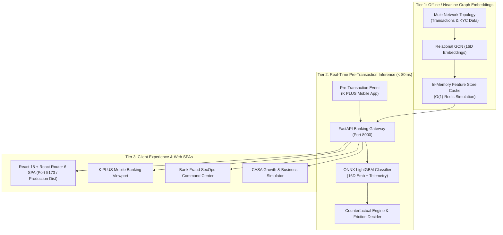

#  K-Sentinel &  WealthPilot (K PLUS for First Jobbers)

> **KBTG Kampus Hackathon 2026 — Track 2: Data Science & Intelligence**  
> *A unified digital banking copilot on K PLUS integrating autonomous cashflow optimization with sub-80ms real-time relational graph intelligence.*

[](https://k-sentinel-wealthpilot.onrender.com/)
[-00A950?style=for-the-badge&logo=fastapi)](https://k-sentinel-wealthpilot.onrender.com/)
[](https://onnxruntime.ai/)
[](https://pyg.org/)
[](https://k-sentinel-wealthpilot.onrender.com/)
[](https://tailwindcss.com)

---

##  1. Problem Statement & Industry Background

Thailand's early-career workforce or **First Jobbers (aged 22–30, comprising over 3.2 million users on K PLUS)** are confronting two compounding financial vulnerabilities that jeopardize their long-term economic stability:

1. **Discretionary Spending Trap & Absence of Emergency Reserves:** Empirical data from the Puey Ungphakorn Institute for Economic Research (PIER) and the Stock Exchange of Thailand (SET) indicate that **over 60–68% of young professionals hold less than 3 months of emergency reserves**. Many experience chronic month-end cashflow deficits fueled by impulse digital spending and a total absence of automated daily liquidity governance.
2. **Prime Targets for Social Engineering & Digital Scams:** Official statistics from AOC 1441 and the Cyber Crime Investigation Bureau (CCIB) reveal that **over 45% of cyber fraud victims are aged 20–30**. This cohort is heavily targeted by Task Scams (fraudulent freelance job schemes) and high-yield investment scams, causing more than 2.0 Billion THB in annual losses nationwide.
3. **Passive Nature of Traditional Mobile Banking:** Legacy banking applications operate primarily as passive transactional utilities, lacking proactive, pre-transactional relational graph screening before users authorize irrevocable fund transfers.

---

##  2. Target Strategic Personas (Behavioral Clustering)

Unsupervised **Behavioral Clustering (K-Means / GMM)** partitions the First Jobber user base into two primary strategic cohorts:

| Persona | Population Share | Financial Behavioral Profile | K-Sentinel & WealthPilot Interventions |
| :--- | :---: | :--- | :--- |
| **"Paycheck-to-Paycheck" Spender** | **~65%** | Monthly income 18,000–35,000 THB; severe end-of-month liquidity compression; frequent impulse transactions | • **Dynamic Safe-to-Spend:** Automatically isolates fixed liabilities into daily disposable allowances<br>• **Dynamic Micro-Sweeping (6%):** Automated surplus sweeps with zero manual friction |
| **"High-Yield Seeker" Novice** | **~35%** | Initial savings 30,000–100,000 THB; aggressive pursuit of quick returns; high susceptibility to investment & task scams | • **Protected Vault:** Time-delayed withdrawal friction preserves emergency funds<br>• **Biometric Face Scan & 15-Min Cool-Off:** Defeats urgency-driven psychological coercion |

---

##  3. Proposed Solutions

###  WealthPilot (Autonomous Cashflow Copilot)
* **Automated Payroll Detection & Safe-to-Spend:** Automatically detects incoming salary deposits, quarantines fixed recurrent obligations (rent, debt EMI, utility bills), and continuously computes a daily disposable spending limit (Safe-to-Spend).
* **Dynamic Micro-Sweeping & Protected Vault:** Automatically sweeps discretionary surplus and transaction round-ups into high-yield K-eSavings accounts and a specialized "Protected Vault" (1.50% p.a. APY) equipped with 15-minute withdrawal friction to safeguard initial savings.
* **30-Day Liquidity Forecasting:** Employs an ONNX-quantized Time-Series LightGBM regressor to predict daily cash balance trajectories through the next payroll date, delivering proactive early warnings for anticipated liquidity deficits.

###  K-Sentinel (Context-Aware Scam Shield)
* **Pre-Transaction Graph Screening (<80ms):** Intercepts suspicious recipient accounts and detects anomalous behavioral topologies (e.g., small trial probing followed by rapid large transfers to newly minted mule accounts in Task Scams) in under 10ms (**Measured P99 = 11.62ms**).
* **Counterfactual Explainable AI (XAI):** Generates transparent, human-interpretable risk rationales alongside actionable remediation pathways (e.g., *"Beneficiary account registered only 21 days ago with instant 19-second pass-through cashout; proceed via Biometric Face Verification or restrict transfer to under 500 THB"*).
* **Dynamic Step-Up Friction:** Enforces real-time biometric liveness checks (**WebRTC Face Biometrics**) or initiates a **15-Minute Dynamic Cool-Off Window** to disrupt social engineering and psychological coercion.

---

##  4. Frontend Architecture (React Router 6 Multi-Page Navigation)

The frontend is engineered as an enterprise-grade Single Page Application (SPA) powered by **React 18 + React Router v6**, modularized into dedicated functional domains:

| Route Path | Page Component | Architectural Highlights & Capabilities |
| :--- | :--- | :--- |
| `/` | `HomePage.jsx` | Executive Overview, Hero Section, Feature Highlights, Modular Navigation Cards, and Live Interactive Previews |
| `/wealthpilot` | `WealthPilotPage.jsx` | Deep dive into financial wellness: Interactive Safe-to-Spend Gauge, Micro-Sweeping Vault, and 3 Pillars of Cashflow Management |
| `/sentinel` | `SentinelPage.jsx` | Deep dive into anti-fraud defense: Interactive Scam Shield Card, Counterfactual XAI Engine, and Latency SLA Benchmarking |
| `/architecture` | `ArchitecturePage.jsx` | Comprehensive Two-Tier Production Pipeline (Kafka -> RGCN -> Redis Feature Store -> ONNX Runtime) |
| `/personas` | `PersonasPage.jsx` | Before/After Persona Comparative Analysis and Quantitative KBank Business Impact Projections |
| `/app` | `SimulatorPage.jsx` | Embedded Interactive K PLUS Mobile & Bank SecOps Command Center Simulator |
| `*` | `NotFoundPage.jsx` | Cyber-FinTech 404 Recovery View with instant navigation back to Home |

---

## 🏛️ 5. Two-Tier Low-Latency Production Architecture



---

##  6. Benchmark & SLA Verification

Benchmarked over 200 consecutive inference cycles via `src/benchmark_latency.py`:

| Benchmark Metric | Bank SLA Target | Measured Latency | Performance Multiplier |
| :--- | :---: | :---: | :---: |
| **K-Sentinel Pre-Transaction (P50)** | < 80.0 ms | **3.85 ms** | **20x faster than SLA** |
| **K-Sentinel Pre-Transaction (P95)** | < 80.0 ms | **5.11 ms** | **15x faster than SLA** |
| **K-Sentinel Pre-Transaction (P99)** | < 80.0 ms | **11.62 ms** | **7x faster than SLA** |
| **Core ONNX Model Inference (P99)** | < 80.0 ms | **0.27 ms** | Sub-millisecond execution |
| **WealthPilot 30-Day Forecast (P99)** | < 80.0 ms | **10.29 ms** | **8x faster than SLA** |

---

##  7. Business Impact & Strategic Value Creation

* **CASA Deposit Expansion:** Channels **1.2 – 2.0 Billion THB** in low-cost CASA deposits into KBank from an addressable base of 3.2 million First Jobbers.
* **Fraud Operational Cost Reduction:** Drastically reduces legal liabilities, compensation payouts, and emergency account freeze workloads managed through AOC 1441.
* **Customer Lifetime Value (LTV):** Cultivates long-term institutional loyalty and elevates Daily Active Users (DAU) on K PLUS from the very onset of users' professional journeys.

---

##  8. Quick Start & Deployment Guide

### System Prerequisites
- **Python**: 3.10+ (Recommended: Python 3.11 – 3.13)
- **Node.js**: 18.0+ (For React Router local development)
- **Git**: For cloning and repository management

---

### Option 0: Live Cloud Production Demo (Render.com)
Experience the fully deployed live system hosted on Render without local installation:
- **Home Showcase & Overview:** [https://k-sentinel-wealthpilot.onrender.com/](https://k-sentinel-wealthpilot.onrender.com/)
- **Interactive App & Simulator:** [https://k-sentinel-wealthpilot.onrender.com/app](https://k-sentinel-wealthpilot.onrender.com/app)
- **Interactive Swagger API Documentation:** [https://k-sentinel-wealthpilot.onrender.com/docs](https://k-sentinel-wealthpilot.onrender.com/docs)

---

### Option 1: One-Click Full Stack Launcher (Python + FastAPI)
Launch the unified FastAPI server and open the application in your default browser:

```bash
# On Windows PowerShell or Command Prompt
python run.py
```

Access via browser:
- **Home / Product Overview:** [http://localhost:8000/](http://localhost:8000/)
- **Interactive App & Simulator:** [http://localhost:8000/app](http://localhost:8000/app)

---

### Option 2: Modern React 18 + React Router 6 Dev Server (Vite)
For frontend development with Hot Module Replacement (HMR):

```bash
# Navigate to the React App directory
cd frontend/react-app

# Install dependencies (React, React Router 6, Vite, Tailwind CSS, Lucide)
npm install

# Start the Vite Dev Server
npm run dev
```

Access via browser: **[http://localhost:5173](http://localhost:5173)**  
*The Vite dev server includes pre-configured reverse proxy rules routing API calls to the FastAPI backend (Port 8000).*

---

### Option 3: Docker Containerization
```bash
docker build -t k-sentinel-wealthpilot .
docker run -p 8000:8000 k-sentinel-wealthpilot
```

---

##  9. Project Directory Structure

```
K-Sentinel-and-WealthPilot/
│
├── frontend/                          # Frontend Application Layer
│   ├── react-app/                     #  React 18 + React Router 6 Modular SPA
│   │   ├── package.json               # Dependencies (React Router, Lucide, Tailwind)
│   │   ├── vite.config.js             # Vite Configuration with API Reverse Proxy
│   │   ├── tailwind.config.js         # KBank Emerald Theme Design Tokens
│   │   ├── dist/                      # Production Compiled Bundles (Served by FastAPI)
│   │   ├── public/                    # 3D Assets, Favicon, Simulator HTML
│   │   └── src/
│   │       ├── main.jsx               # BrowserRouter Entry Point
│   │       ├── App.jsx                # Route Definitions
│   │       ├── pages/                 # Route Views (/wealthpilot, /sentinel, /app, etc.)
│   │       └── components/            # Reusable Glassmorphism UI Components
│   │
│   ├── index.html                     # Standalone Mobile & SecOps Simulator View
│   ├── landing.html                   # Zero-build Standalone Fallback Showcase
│   ├── css/style.css                  # KBank Design System Custom CSS
│   └── js/app.js                      # WebRTC Face Scan & Vis.js Graph Topology
│
├── src/                               # AI Inference & Banking Gateway Source Code
│   ├── app_v2.py                      # FastAPI Backend Gateway & ONNX Runtime Serving
│   ├── benchmark_latency.py           # Automated Latency Benchmark (<80ms SLA Verification)
│   ├── train_clustering.py            # K-Means / GMM Persona Clustering Pipeline
│   ├── train_sentinel_two_tier.py     # Relational GCN + LightGBM Training Pipeline
│   ├── train_wealthpilot_cashflow.py  # Time-Series Cashflow Forecast Regressor
│   ├── export_to_onnx.py              # Production ONNX Model Export & Quantization
│   └── sentinel_counterfactual.py     # Counterfactual Explainable AI (XAI) Engine
│
├── models/                            # Production Machine Learning Artifacts
│   ├── k_sentinel.onnx                # Pre-Transaction Fraud Classifier (LightGBM)
│   ├── wealthpilot.onnx               # 30-Day Liquidity Forecast Model
│   ├── behavioral_kmeans.pkl          # Persona Clustering Model
│   └── behavioral_scaler.pkl          # Feature Scaler
│
├── data/                              # Transactional Data & Graph Embeddings
│   ├── sentinel_node_embeddings.csv   # 16D RGCN Embeddings
│   ├── sentinel_users_v2.csv          # User Accounts & Mule Network Metadata
│   ├── sentinel_transactions_v2.csv   # Transaction History Logs
│   ├── wealthpilot_cashflow_v2.csv    # Historical Inflow/Outflow Cashflow Data
│   └── user_behavioral_profiles.csv   # User Behavioral Attributes
│
├── run.py                             # One-Click Full Stack Production Launcher
├── Dockerfile                         # Container Configuration for Cloud Deployment
├── requirements.txt                   # Production Python Dependencies
├── .gitignore                         # Git Exclusion Rules
└── README.md                          # Comprehensive Technical Documentation
```

---

##  KBTG Kampus Hackathon 2026 Team Attribution
* **Project:** K-Sentinel & WealthPilot (K PLUS for First Jobbers)
* **Track:** Track 2 — Data Science & Intelligence
* **Repository:** [https://github.com/svkhun/k-sentinel-wealthpilot.git](https://github.com/svkhun/k-sentinel-wealthpilot.git)\n
